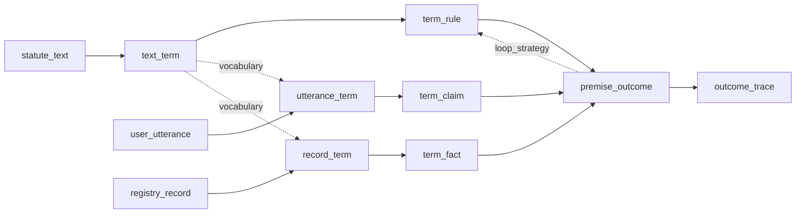

# statute-decider — the architecture plan (this submission)

*(File renamed on 2026-09-06 — Ruling K, no version suffixes in file names; the old name is in `docs/reference/id-aliases.md`. Content otherwise unchanged; "v2" in the prose below names the rewrite generation, not a file.)*

**Standing rule: rewrite, not port.** Current `framework/`, scripts, schemas, provider wrappers are not constraints; git tag `pre-refactor` is the archive. The **oracle knowledge** (which statutes, which cases, which expected outcomes — the validated content) survives as reference material, but its files are re-authored fresh in the v2 shapes; no old file layout, field name, or probe code constrains the new design.

## Terminology

Drop **gold / golden** everywhere.

| Label | Means | Short form |
|---|---|---|
| **oracle** | Hand-authored and validated artifacts *and* the act of producing them | `oracle` |
| **llm-only** | LLM-only mechanism and its data | `llm-only` |
| **proposed architecture** | The modular system under test and its data | **`architecture`** |

Paper prose keeps Priit's **proposed architecture**; `architecture` is the code/config handle. Triad: **oracle → llm-only → architecture**. (Condition names as settled on 2026-09-05; the plan's original working labels are listed in `docs/reference/id-aliases.md`.)

## The graph — sources, epistemic types, one shared vocabulary

The design insight your comments force: the nodes are not just renamed pipes — they carry **epistemic status**. What the user says can be wrong and is only ever *asserted*; what a register returns can also be wrong in the world, but it is *institutionally warranted* and therefore decision-grade; what the statute defines is *normative*, neither true nor false. The naming must encode that, because the paper's core claim rests on it — call it the **warrant principle**: unwarranted information must never decide an outcome, and when decision-relevant information is missing or unwarranted, the system must say so and name it.

### Three sources (generalizable families)

| Node | Family | Definition |
|---|---|---|
| `user_utterance` | `*_utterance` | Free text from the person asking. Subjective, incomplete, possibly wrong. Never decision-grade by itself. (Generalized from `case_utterance` — the source is the *user*.) |
| `statute_text` | `*_text` | Authoritative normative text. Today one statute fragment; the node accepts more text sources later (`regulation_text`, `caselaw_text`, `guideline_text`) feeding the same successor. |
| `registry_record` | `*_record` | Structured record from an institutional register. Can be stale or wrong in the world, but carries institutional warrant. |

### One vocabulary: the term — and term-finding in every chain

Everything meets in a single boolean vocabulary. A **term** is one named boolean variable (e.g. `parent`, `emergency`). Terms are the grounding currency: rules are written over terms, claims and facts assign values to terms.

Term-finding is not a statute-only step — every chain does it, so every chain has the same three-hop shape: **source → raw form → terms → typed artifact**. The difference is the *relation* to the vocabulary:

- `text_term` **defines** the vocabulary (authority),
- `utterance_term` **recognizes** which terms the utterance speaks about (grounding),
- `record_term` **maps** record fields onto terms (schema mapping, fixed per register).

`text_term` feeds the other two as the catalog input. Vocabulary mismatch — a node producing rules or claims in a vocabulary the catalog does not define — is therefore a first-class, measurable coverage rate per term node, not a failure discovered downstream.

### The levels

The graph has five named levels; every node belongs to exactly one:

| Level | Nodes | What lives here |
|---|---|---|
| **source** | `statute_text`, `user_utterance`, `registry_record` | Raw input payloads |
| **term** | `text_term`, `utterance_term`, `record_term` | The shared vocabulary: defined / recognized / mapped |
| **premise** | `term_rule`, `term_claim`, `term_fact` | Inputs to inference over terms — normative / asserted / warranted |
| **outcome** | `premise_outcome` | The decision |
| **trace** | `outcome_trace` | The justification |

**Premise** is the name of the level after terms: a rule, a claim, and a fact are all *premises* — inputs to the inference — distinguished by epistemic type. The word is role-based (what the decision consumes), works per item (code supertype `Premise`, tagged normative/asserted/warranted) and per collection (the premise set Γ the outcome is derived from), is logic-agnostic across the propositional → predicate/HOL upgrade, and reads naturally in the paper. Caveat, resolved argumentation-theory style: claims are *defeasible* premises — "a claim alone cannot fire a rule" is a policy about how a premise may be used, driven by its epistemic type, not grounds to exclude it from the set. (Rejected: *statement* — form-based, says nothing about role; *argument* — that is the output side, outcome+trace; *theory* — privileges rules, same flaw as `rule_outcome`; *knowledge base* — claims are precisely not knowledge, which is the warrant principle.)

### Derived nodes (hinge rule `A_B → B_C`, singular names)

Hinge rule amendment for joins: a node with multiple predecessors takes its first token from the **level name** of its inputs, not from any single node — so the decision node is `premise_outcome` ("from the premises, the outcome"), not `rule_outcome`, which falsely privileged one input.

| Node | From | Definition (epistemic type) |
|---|---|---|
| `text_term` | `statute_text` | Term vocabulary *defined* by the normative text. *Definitional; the authority.* |
| `term_rule` | `text_term` | Norms as boolean rules over terms (`allow_if_all` / `deny_if_all` / rewrite rules). *Normative.* |
| `utterance_term` | `user_utterance` (+ vocabulary) | Terms *recognized* in the utterance — which vocabulary items the case addresses. Measures understanding, not truth. |
| `term_claim` | `utterance_term` | **Claim** = an *asserted* value per recognized term `(term, value, provenance: utterance span)`. Fallible; never decision-grade alone. |
| `record_term` | `registry_record` (+ vocabulary) | Terms *addressed* by the record's fields (field-to-term mapping). |
| `term_fact` | `record_term` | **Fact** = a *warranted* value per mapped term `(term, value, provenance: record)`. Decision-grade. ("Fact" = institutionally warranted, not metaphysically true — defined once, in code and paper.) |
| `premise_outcome` | join (premise level) | The decision: ALLOW / DENY / NEED_MORE_INFO plus the set of **missing terms** (terms that could still change the outcome and have no decision-grade value). Produced from `term_rule` + `term_claim` + `term_fact`. |
| `outcome_trace` | `premise_outcome` | Human-readable justification linking the outcome to the rules, terms, claims, and facts that produced it. |

Chains (hinges in parentheses) — fully symmetric:

- statute: `statute_text → text_term → term_rule` (statute → text → term → rule)
- user: `user_utterance → utterance_term → term_claim` (user → utterance → term → claim)
- register: `registry_record → record_term → term_fact` (registry → record → term → fact)
- join: `term_rule + term_claim + term_fact → premise_outcome → outcome_trace` (premise → outcome → trace)



The warrant principle falls out of the types: a term with only a claim (no fact) cannot fire a rule; if it could change the outcome, it appears in missing terms. Verification status lives in the graph, not in a prompt.

Loop re-invokes `term_rule` (or `text_term` when the vocabulary itself is wrong) with `premise_outcome` as extra input. No extra node.

### Staged vs fused execution — term and premise levels stay independent

The term node and its premise node are **separately bindable**: each gets its own method, so any mix is a valid condition — `utterance_term: llm` + `term_claim: oracle` (did the LLM recognize the right terms, given hand-validated values?) or `utterance_term: oracle` + `term_claim: llm` (given perfect recognition, does the LLM assign values correctly?). This is the per-level checkability you asked for.

When staging is unnecessary, adjacent nodes **fuse**: one call fills both, declared explicitly in the condition —

```yaml
fuse:
  - [utterance_term, term_claim]    # one llm call recognizes terms and assigns values
```

Fusion is an execution optimization only: both node values are still recorded and both scorers still run (coverage on the term node, value accuracy on the premise node), so the metrics split survives regardless of how the work was batched.

### Every node is checkable — the uniform node interface

The point of the graph is that **each step can be performed and checked by different mechanisms independently**. Every node implements the same contract:

1. **Inputs** — the predecessor node values (typed).
2. **Method** — how the node is performed: `oracle` (hand), `llm`, or a deterministic method (`solver`, `lookup`, `match`, `render`, `file`); `skip` where a condition bypasses the node. **Strategy** — registered variant under a method (`select`, `synthesize`, `ground`, `remap`, …).
3. **Output schema** — the node's epistemic type above; provenance recorded on every value: producing node, method, strategy, model, prompt id + content hash, timestamp.
4. **Oracle dataset** — the hand-validated value of this node for every scenario (JSON, same schema as produced values), stored at the scope that determines it (statute / register / case — see Scoping). This is what makes the node *checkable*: any method's output can be scored against it.
5. **Scorer** — node-appropriate metric (term-set coverage/F1 for term nodes, rule equivalence for `term_rule`, assignment accuracy for `term_claim`/`term_fact`, per-class F1 + missing-term set metrics for `premise_outcome`).

Two evaluation modes per node, both first-class:

- **Isolation:** feed *oracle inputs*, score this node's output against its oracle dataset — measures the step itself.
- **Propagation:** feed *produced upstream outputs* — measures the step inside a condition, error compounding included.

A **condition** is then just a named binding of methods onto nodes (plus fuse declarations), and end-to-end scoring is the propagation mode of `premise_outcome`. Solver-validation, llm-only and architecture are conditions, not extra machinery.

### The experimentation matrix

One row per chain × level × node × method — atomic cells so gaps are visible. Capability principle: **every derived node supports `oracle` and `llm`**; deterministic methods (`match`, `lookup`, `solver`, `render`, `parse`ᶠ) are the trusted-path options. Every derived node additionally supports `skip` (condition bypass; no strategy — kept out of the rows to keep gap-scanning clean). `oracle` doubles as a production binding: when a condition needs the hand-validated value as input (e.g. the architecture condition's statute chain), it binds `oracle` — there is no separate "hand-written config" method, because in this repo that file *is* the oracle. What a condition *binds* is config — the matrix never precludes an experiment. Strategy is the variant within a method: a prompt (llm), a backend (solver), a template (render), or the manual authoring action (oracle). ᶠ = future — in the table on purpose, so expansion slots are visible.

**Node families exist at every level**, and the wildcard side carries meaning. Two orthogonal axes drive membership: **chain = epistemic role** (who vouches: normative / asserted / warranted) and **raw form = syntax** (what shape: text / utterance / record / markupᶠ / documentᶠ). At **source** the wildcard is left (`*_text`): many sources per raw form. At **term** the family is `*_term`, keyed by **raw form, not chain** — a new member appears whenever any chain gains a new raw form (e.g. `statute_markup`ᶠ → `markup_term`ᶠ, still normative; `user_document`ᶠ → `document_term`ᶠ, still asserted — shape does not upgrade warrant). At **premise** the wildcard flips right (`term_*`): one member per epistemic type; new members are new epistemic types. **Outcome** (`*_outcome`) and **trace** (`*_trace`) are single-member families at the join — they appear once, not per chain: one node fed by all three chains, same dedupe principle as everywhere else.

| Chain | Level | Node family | Node | Method | Strategy / variant |
|---|---|---|---|---|---|
| statute | source | `*_text` | `statute_text` | `file` | fixture file in `data/statutes/` |
| statute | source | `*_text` | `statute_text` | `live`ᶠ | statute API (e.g. Riigi Teataja) |
| statute | source | `*_text` | `statute_text` | `generate`ᶠ | synthetic statute authoring |
| statute | source | `*_text` | `regulation_text`ᶠ · `caselaw_text`ᶠ · `guideline_text`ᶠ | as above | new family members; feed the same `text_term` |
| statute | source | `*_markup`ᶠ | `statute_markup`ᶠ | as above | machine-readable legislation (e.g. Akoma Ntoso) |
| statute | term | `*_term` | `text_term` | `oracle` | hand-defined catalog |
| statute | term | `*_term` | `text_term` | `llm` | `select` / `synthesize` + prompt variants |
| statute | term | `*_term` | `markup_term`ᶠ | `oracle` · `parse`ᶠ · `llm` | vocabulary parsed from structured markup (deterministic — structure admits it); new raw form, same chain |
| statute | premise | `term_*` | `term_rule` | `oracle` | hand-authored rules |
| statute | premise | `term_*` | `term_rule` | `llm` | `select` / `synthesize` + prompts; loop re-entry (`remap` / `regenerate`) |
| statute | premise | `term_*` | `term_presumption`ᶠ | `oracle` · `llm` | new epistemic type: statutory presumptions / defaults |
| user | source | `*_utterance` | `user_utterance` | `file` | fixture file |
| user | source | `*_utterance` | `user_utterance` | `live`ᶠ | live intake |
| user | source | `*_utterance` | `user_utterance` | `generate`ᶠ | synthetic utterance authoring |
| user | source | `*_utterance` | TBDᶠ | as above | other asserted sources (e.g. third-party statements) |
| user | source | `*_document`ᶠ | `user_document`ᶠ | as above | uploaded evidence / contract documents (asserted — shape does not upgrade warrant) |
| user | term | `*_term` | `utterance_term` | `oracle` | hand-tagged recognition |
| user | term | `*_term` | `utterance_term` | `llm` | `ground` (with vocabulary) / `open` (without) + prompts |
| user | term | `*_term` | `document_term`ᶠ | `oracle` · `llm` | recognition from attached documents; new raw form, same chain |
| user | premise | `term_*` | `term_claim` | `oracle` | hand-assigned values |
| user | premise | `term_*` | `term_claim` | `llm` | valuation prompts (fusable with `utterance_term`) |
| register | source | `*_record` | `registry_record` | `file` | fixture JSON |
| register | source | `*_record` | `registry_record` | `live`ᶠ | register API |
| register | source | `*_record` | `registry_record` | `generate`ᶠ | synthetic record authoring |
| register | source | `*_record` | TBDᶠ | as above | other warranted machine sources |
| register | term | `*_term` | `record_term` | `oracle` | hand-validated field-to-term mapping |
| register | term | `*_term` | `record_term` | `match` | deterministic name/alias matching against the term catalog |
| register | term | `*_term` | `record_term` | `llm` | schema-mapping prompts |
| register | term | `*_term` | `record_term` | `vendor`ᶠ | mapping ingested from register documentation, scored against oracle |
| register | premise | `term_*` | `term_fact` | `oracle` | hand-assigned values |
| register | premise | `term_*` | `term_fact` | `lookup` | deterministic via the mapping |
| register | premise | `term_*` | `term_fact` | `llm` | record-reading prompts (fusable with `record_term`) |
| join (all) | outcome | `*_outcome` | `premise_outcome` | `oracle` | bind expected outcome (isolation testing) |
| join (all) | outcome | `*_outcome` | `premise_outcome` | `solver` | backends: `z3` · `pysat`ᶠ · `clingo`ᶠ · `horn`ᶠ · HOLᶠ |
| join (all) | outcome | `*_outcome` | `premise_outcome` | `llm` | decide prompts |
| join (all) | trace | `*_trace` | `outcome_trace` | `oracle` | hand-written reference trace |
| join (all) | trace | `*_trace` | `outcome_trace` | `render` | deterministic rendering of the inference record → `solver_trace` entry |
| join (all) | trace | `*_trace` | `outcome_trace` | `passthrough` | the deciding model's inline steps + justification → `llm_inline` entry; no call (ADR 0007) |
| join (all) | trace | `*_trace` | `outcome_trace` | `llm` | optional post-hoc `justify` node; appends an `llm_post` entry, in neither default pipeline |

The matrix is symmetric where symmetry means something — three chains with identical `oracle`/`llm`/`skip` sets at term and premise levels, plus deterministic options exactly where the source is structured (`match`+`lookup` on records, `parse`ᶠ on markup; natural language offers no structure to exploit) — and deliberately asymmetric at the join, which has no chain and alone gains `solver`.

### Executor columns — the master matrix has three more

Model, provider, and prompt generalize to **every** method, not just `llm`: each method has an **executor** (Provider + Model — who/what performs it) and a **consumed artifact** (Prompt column, generalized — what parameterizes it). These are full columns of the master matrix:

| Method | Provider | Model | Consumed artifact |
|---|---|---|---|
| `llm` | `anthropic` · `openai` · `google` · `deepseek` (from `configs/llm/models.yaml`) | model id from the registry | prompt variant from `prompts/<node>/…` |
| `solver` | backend project (`z3` · `pysat`ᶠ · `clingo`ᶠ …) | backend + version | encoding options |
| `oracle` | `human` | `operator` | authoring procedure / notes |
| `match` / `lookup` / `render` / `parse`ᶠ / `file` | `code` | repo commit | mapping file · alias table · render template · fixture path |

The hand-maintained table above stays at node × method granularity for readability; the **full expansion is generated, not hand-written**: `sd matrix export` produces `docs/matrix.csv` from the code registries (nodes, methods, strategies) joined with `configs/llm/models.yaml` and `prompts/` — one row per chain × level × node × method × strategy × provider × model × prompt. It is always in sync with what the code can actually run, and it is the file you filter and pivot.

**The complete coordinate system.** Everything that identifies a run cell, sorted by where it lives:

- **Capability coordinates** (the master matrix): chain, level, node family, node, method, strategy, provider, model, consumed artifact (prompt / backend / template / mapping).
- **Grid coordinates** (`experiment.yaml`): sampling config (temperature, max tokens), logic level, fuse pairs, loop strategy, repeats + seed, data selection (statute × case × scenario), execution mode, budget cap.
- **Recorded outcomes** (never chosen, always written): cost, latency, timestamp, content hashes.

Every line in `rows.jsonl` carries the **fully resolved coordinate vector** — all three groups — so any run row *is* a cell of the master matrix plus its grid position, and any analysis can group by any coordinate after the fact.

**How to read this as a menu.** The matrix is the *capability* space — what the code can do. What we are *testing* is a selection: matrix rows × data inventory × grid. Capability and active experiment are different things by construction, which is exactly the supervision conversation: the exported CSV says what the system can do; a condition YAML + `experiment.yaml` say what this paper exercises. The runner opens every `summary.md` by rendering the bound matrix rows — "what did we test" is generated, never reconstructed from memory. Analyses cite matrix coordinates when referring back.

**Loop** (grid coordinate): `off` · strategy on `term_rule`: `LoopStrategy.apply(term_rule, premise_outcome) -> term_rule`. **Logic** (grid coordinate): `propositional` · `predicate`ᶠ · `hol`ᶠ.

**Solver protocol** (behind `premise_outcome.method=solver`): `solve(term_rule, term_claim, term_fact) -> premise_outcome`; z3 first, other backends as the same Protocol.

**Solver vs render — inference vs presentation.** The solver *decides*: it computes the outcome and, as part of `premise_outcome`'s payload, emits the machine-readable inference record (fired rules, valuation used, missing terms and why). `render` is a pure function of that record: it turns it into human-readable justification text via a template, performs no reasoning, and cannot change the outcome. The trace is a separate node because explanation is separately measurable (against oracle traces) and separately swappable (`render` vs `llm` justification) — and because an `llm`-decided outcome has no inference record, so its trace can only come from `llm`, which is itself worth measuring.

```yaml
condition: architecture
statute_text:      { method: file }
text_term:         { method: oracle }
term_rule:         { method: oracle }
user_utterance:    { method: file }
utterance_term:    { method: llm, strategy: ground, prompt: ground }
term_claim:        { method: llm, prompt: value }
registry_record:   { method: file }
record_term:       { method: oracle }
term_fact:         { method: lookup }
premise_outcome:   { method: solver, solver: z3 }
outcome_trace:     { method: render }
fuse:
  - [utterance_term, term_claim]
logic: propositional
```

### Committed runs — and nothing more in this plan

Three conditions are named and committed; they are what Priit's 1 Sep questions require. Every other cell of the matrix is *expressible* as a condition YAML + experiment when we want it, and is deliberately **not** pre-specified here — extra runs to strengthen the paper or mark future avenues get defined as experiments at that moment, not planned now.

1. **solver-validation** — every node `oracle`/`file`, `premise_outcome=solver`, `outcome_trace=render`. No LLM, essentially free; proves the endpoint and the oracle data agree. Row 1 of any table.
2. **llm-only** — source to trace: sources `file`, all derivation nodes `skip`, `premise_outcome=llm` on the raw inputs in **one** structured call (steps, outcome, missing terms, justification), `outcome_trace=passthrough`. The pure counterpart.
3. **architecture** — the proposed architecture, run as robustly as budget allows: statute chain `oracle`, `utterance_term`+`term_claim` `llm` (fused, `ground`), `record_term=oracle`, `term_fact=lookup`, `premise_outcome=solver(z3)`, `outcome_trace=render`. Cheap-model grid × repeats, per-class F1, budget-capped.

The llm-only and architecture conditions on the same scenario suite with the same models and repeats give the decision-step comparison Priit asked for today; how the numbers are framed (which rows lead, what "identical inputs" means) is a writing decision for Friday 4 Sep with the numbers on the table.

## Data structures

Format ruling — three planes, split by role rather than author:

- **Config plane = YAML.** Experiments, conditions, scenarios, field-to-term mappings — human decisions, comments welcome.
- **Data plane = JSON/JSONL.** **Every node value, oracle or produced.** An oracle `term_rule` file is a node value whose method happens to be `oracle`; it is compared against produced values and fed as input in isolation mode, so it must be format-identical to them — same JSON, same Pydantic schema (in `core/`, the single authority), validated identically. Authoring notes live in a `notes` field, not comments.
- **Document plane = `.txt`/`.md`.** Raw statute text and utterances, referenced by path, never inlined.

### Source level

- **`statute_text`** — plain text file + YAML sidecar: `source_id`, act/section references, jurisdiction, language, version date. Multiple files allowed per case (future `regulation_text` etc. are more sidecars with a different `kind`).
- **`user_utterance`** — plain text file + YAML sidecar: `utterance_id`, language, scenario tags.
- **`registry_record`** — **JSON** mock database: it mocks a machine interface, so it looks like what a register would actually return. Design rule: **sources are vocabulary-free.** Records hold raw fields; translating fields into terms is `record_term`'s job, never the source file's. Each register carries its **warrant** — the trust axis is source data, not run configuration:

```json
{
  "registers": [
    {
      "register_id": "trader_crm",
      "label": "Trader CRM",
      "warrant": "authoritative",
      "records": [
        { "record_id": "crm-001", "fields": { "customer_type": "consumer", "sales_channel": "web_shop" } }
      ]
    }
  ]
}
```

### Term level

A **Term**: `term_id` (snake_case, singular), `label`, `definition`, and logic forms per level (`propositional` atom now; `predicate` / `higher_order` slots reserved for the logic upgrade).

- `text_term` output: the **term catalog** — terms + clause anchors into `statute_text` (clause id, quoted span).
- `utterance_term` output: term references recognized in the utterance — `term_id`, utterance span, confidence.
- `record_term` output: field-to-term mapping instances — `term_id`, `register_id.field`, transform (e.g. `customer_type == consumer → is_consumer`).

### Premise level

One envelope, three kinds. `Premise`: `premise_id`, `kind` (`rule` | `claim` | `fact`), epistemic tag (`normative` | `asserted` | `warranted`), `terms` referenced, `provenance` (producing node, method, model/hand, timestamp). Payload per kind:

- **rule**: `rule_kind` (`allow_if_all` | `deny_if_all`, extensible), antecedent `term_ids`, `outcome_id`, law references (clause id/title/quote).
- **claim**: `term_id`, boolean `value`, utterance span. *Asserted; defeasible.*
- **fact**: `term_id`, boolean `value`, `register_id.record_id.field`, inherited `warrant`. A `trust_only` fact is stored as a fact but demoted to claim-strength at decision time — the warrant principle enforced as a data property, not prompt engineering.

### Outcome and trace

- **`premise_outcome`**: fine-grained `state` (extensible beyond the scored three, e.g. distinguishing *unverifiable* from *unknown*) + `scored_as` (ALLOW / DENY / NEED_MORE_INFO), **`missing_terms`** (term + why: no value / unwarranted only / conflict), fired rules, the valuation used, solver/model metadata.
- **`outcome_trace`**: ordered inference steps referencing premise ids, plus a rendered human-readable justification.

### Scoping — store once, at the scope that determines it

No duplication of shared knowledge: **a node value lives with the entity that determines it, and everything else references it by id.**

- **Statute-determined** — `statute_text`, oracle `text_term`, oracle `term_rule`: one statute fragment determines its vocabulary and rules regardless of which case uses it → stored once per statute in `data/statutes/<statute_id>/`.
- **Register-determined** — register schema and oracle `record_term` (the field-to-term mapping): one register type maps its fields the same way in every case → stored once per register in `data/registers/<register_id>/`.
- **Scenario-determined** — utterances, register record *values* (the mock state), oracle `utterance_term` / `term_claim` / `term_fact` / `premise_outcome` / `outcome_trace`: these genuinely differ per scenario → stored in the case folder.

A case is then a thin assembly: `case.yaml` names its statute id(s) and register id(s); manual investigation is one hop from the case folder to the shared entity. The same principle already holds *inside* the data: premises reference `term_id`s, never embed term definitions; outcomes reference premise ids.

### Prompts — versioned data, swept like models

Every LLM-method node call renders a **prompt template** (config plane): `prompts/<node>/<strategy>/<variant>.md`, with YAML frontmatter (description, declared placeholders) and the template body. Rules:

- **Strategy picks the code path** (`select` vs `synthesize` differ in logic); **`prompt` picks the wording variant within it** — a condition binds both: `utterance_term: { method: llm, strategy: ground, prompt: ground }`. Nodes with a single code path (e.g. `term_claim`) drop the strategy segment: `prompts/<node>/<variant>.md`.
- A **fused pair binds one prompt**, declared on the first node of the pair — one call, one template, two recorded node values.
- One file per prompt, named for what it does (`ground.md`, `decide-raw-sources.md`), never for a version — an edit is a commit, and provenance on every produced node value records the prompt id *and* content hash (`prompt_hash`), so old results stay interpretable. (Ruling K, 2026-09-06; until then the rule was "new wording = new `-vN` file".) A genuinely different wording that should coexist with the current one gets a descriptive name, not a number.
- `experiment.yaml` can sweep prompts exactly like models: `prompts: {utterance_term: [ground, ground-terse]}` multiplies the run grid, and the report groups by prompt id. Prompt A/B testing is an experiment, not a code change.

### Scenarios and oracle data

A **scenario** (hand-authored YAML) binds sources to expectations: source file refs, register state (or overrides), and the expected value of *any* node — minimally `premise_outcome`, ideally each node, stored as oracle JSON per case (layout below). **Oracle files are authored fresh in these shapes** — the existing hand-validated material (statutes, cases, expected outcomes) is content reference only, never a schema to convert; nothing in the old file layouts constrains these models.

## LLM client (aipip as inspiration, not a dependency)

Write a **new** client in `src/statute_decider/llm/` — [aipip](file:///Users/ottomattas/src/artifig/aipip/README.md) supplies the shape (interface, per-vendor clients, registry, pydantic settings), not the code. Fold back into aipip as v2 after submission.

Must have: structured output, asyncio fan-out, per-provider semaphores, retries/timeouts, budget guard + ledger, usage/EUR, Anthropic / OpenAI / Gemini / DeepSeek.

Flags — no silent defaults; one model or all:

```
sd run --config configs/conditions/architecture.yaml --execution parallel --models haiku-4.5
sd run --config configs/conditions/architecture.yaml --execution sequential --models all
```

- `--execution {parallel,sequential}` — required, no default.
- `--models` — required: one id, a list, or explicit `all`.
- `--providers` — optional filter. `--solver` — optional override of `premise_outcome.solver` (one, list, or `all`).

## Layout

Two organizing principles: **data is case-first** (authoring and validating a case happens in one folder — the engine globs across cases; you never should), and **runs are experiment-first** (one folder per experiment holds its definition, results, and analysis — investigating an old run never means joining folders by memory).

```
statute-decider/                    # repo + CLI name; Python import statute_decider
  pyproject.toml
  README.md
  src/statute_decider/              # code only — never data
    core/                           # term, premise (rule/claim/fact), outcome, trace types; provenance; levels
    nodes/                          # one package per node: statute_text, text_term, term_rule, user_utterance, utterance_term, term_claim, registry_record, record_term, term_fact, premise_outcome, outcome_trace
    strategies/                     # llm strategies (select, synthesize, …) + loop strategies (remap, regenerate, …)
    solvers/                        # Protocol + backends (z3 first)
    llm/                            # new client
    runner/                         # experiment engine, scoring (isolation + propagation), reports
  configs/
    llm/                            # models.yaml, prices.yaml
    conditions/                     # reusable graph bindings: solver-validation.yaml, llm-only.yaml, architecture.yaml, architecture-staged-grounding.yaml
  prompts/
    <node>/<strategy>/<variant>.md  # versioned prompt templates, YAML frontmatter; new wording = new file
  data/
    statutes/<statute_id>/          # statute-determined, stored once
      statute.txt                   # + statute.yaml sidecar
      oracle/
        text_term.json              # the vocabulary this statute defines
        term_rule.json              # the rules this statute defines
    registers/<register_id>/        # register-determined, stored once
      schema.yaml                   # fields, default warrant
      oracle/
        record_term.json            # field-to-term mapping
    cases/<case_id>/                # scenario-determined only; thin assembly
      case.yaml                     # names statute id(s) + register id(s)
      sources/
        utterances/<scenario_id>.txt
        registry.json               # record values for this case (mock state, raw fields + warrant)
      oracle/
        utterance_term/<scenario_id>.json
        term_claim/<scenario_id>.json
        term_fact/<scenario_id>.json
        premise_outcome/<scenario_id>.json
        outcome_trace/<scenario_id>.json
      scenarios/<scenario_id>.yaml  # binds sources + register state + expectations
  experiments/
    _template/                      # copy to start a new experiment
    <YYYYMMDD>-<slug>/              # e.g. 20260903-architecture-sota
      experiment.yaml               # the definition: condition ref, cases, models, prompts, repeats, budget, question
      results/
        config.snapshot.yaml        # fully resolved config at run time (reproducibility)
        rows.jsonl                  # one row per scenario x model x repeat
        nodes/<node>.jsonl          # recorded node values (enables offline re-scoring, isolation cuts)
        ledger.jsonl                # cost slice for this run
        run.log
        summary.md                  # generated report; opens with the bound matrix rows ("what we tested")
      analysis/                     # your notebooks / follow-up markdown, next to the data they analyze
  tests/
  docs/
```

The connection between layers is by **name, in one direction**: `experiment.yaml` names a condition (from `configs/conditions/`), cases (from `data/cases/`), and models (from `configs/llm/models.yaml`); the run snapshots everything it resolved into `results/config.snapshot.yaml`, so an old experiment is interpretable even after configs or cases change.

Finding things fast: *edit a case* → `data/cases/<case>/` (its `case.yaml` points to the shared statute/register); *fix the statute vocabulary or rules* → `data/statutes/<statute>/oracle/`, once, for every case using it; *try a new prompt wording* → add `prompts/<node>/<strategy>/<new-variant>.md` and sweep it in an experiment; *change what a condition binds* → `configs/conditions/`; *start an experiment* → copy `experiments/_template/`; *check last week's run* → `experiments/<date>-<slug>/results/summary.md`; *dig into why a row scored wrong* → same folder, `nodes/<node>.jsonl`.

Deps: `.venv` + `pip install -e '.[dev]'` (optional `.[solvers]`). Data, results, and logs all in git.

## Paper week vs rewrite

1. Tag `pre-refactor` (cherry-pick the oracle-llm branch first so the 1880 rows are in history).
2. Replace `framework/` with the node graph; author oracle data fresh from the validated content, each value at its determining scope (`data/statutes/`, `data/registers/`, `data/cases/`).
3. New LLM client; solver Protocol + z3.
4. Conditions as YAML; scoring n, Acc, per-class F1 (+ missing-term set metrics stored).
5. Run the committed cells — solver-validation, llm-only, architecture — (parallel, budget-capped). Old numbers superseded.
6. Paper rewrite. Friday 4 Sep reviews narrative even without final numbers; Tue 8 Sep reads with numbers; submit by 13 Sep AoE.

Rollback = the git tag.

## Settled

- Naming: hinge rule, singular; all chains symmetric, source → term → premise: `statute_text → text_term → term_rule`; `user_utterance → utterance_term → term_claim`; `registry_record → record_term → term_fact`. Joins hinge on the input **level** name: `premise_outcome → outcome_trace`.
- Levels: source, term, **premise** (rule/claim/fact), outcome, trace.
- Epistemic types: claim = asserted (defeasible) premise; fact = warranted premise; rule = normative premise; term = vocabulary. Warrant principle encoded in types.
- Checkability: uniform node interface; oracle dataset per node; isolation + propagation scoring; term and premise levels separately bindable, with explicit `fuse` when one call fills both.
- Old code: git tag only; no port, no legacy tree. Golden → oracle / llm-only / architecture.
- Repo/CLI hyphen, import underscore; results in git; `.venv` + pip.

## What I need from you

Nothing blocks execution: naming, levels, data shapes, layout, and the matrix are settled above; committed runs are solver-validation, llm-only, and architecture, with everything else defined as experiments only when wanted. Give the go and the rewrite starts with tag `pre-refactor`.